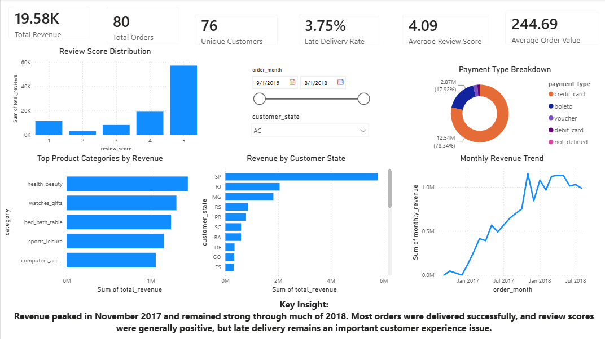
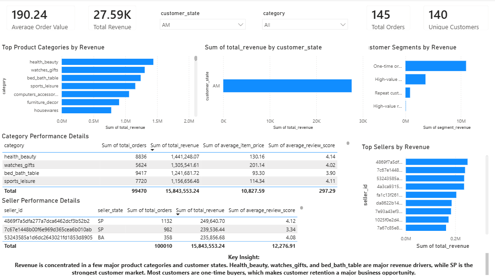
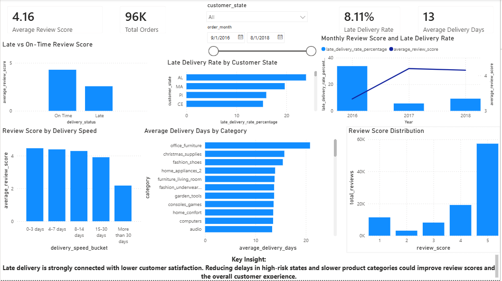

# Olist E-Commerce Business Performance Analysis

## Project Overview

This project analyzes the Olist Brazilian E-Commerce dataset to evaluate marketplace revenue, customer behavior, product category performance, seller performance, delivery efficiency, payment behavior, and customer satisfaction.

The goal of this project is to use SQL, PostgreSQL, Power BI, and business analysis techniques to transform raw e-commerce data into actionable insights for business decision-making.

## Business Problem

Olist wants to better understand its sales performance, delivery performance, customer satisfaction, and marketplace growth opportunities. This analysis focuses on identifying revenue drivers, high-performing categories, regional demand, seller concentration, delivery issues, and the relationship between delivery performance and review scores.

## Tools Used

- PostgreSQL: database storage and SQL analysis
- SQL: data validation, cleaning views, business analysis, CTEs, window functions, and KPI calculations
- Power BI: dashboard creation and visual reporting
- Excel/CSV: data review and export
- GitHub: project documentation and version control

## Dataset

The project uses the Olist Brazilian E-Commerce dataset, which contains order, customer, product, seller, payment, review, and geolocation data.

Main tables used:

- customers
- orders
- order_items
- order_payments
- order_reviews
- products
- sellers
- product_category_translation
- geolocation

## Project Workflow

1. Created PostgreSQL tables and imported raw CSV files.
2. Performed data validation checks for duplicates, missing values, invalid values, date inconsistencies, and relationship integrity.
3. Created cleaned SQL views for analysis-ready datasets.
4. Wrote core business analysis queries to evaluate revenue, orders, customers, products, sellers, payments, delivery, and reviews.
5. Wrote advanced SQL queries using CTEs, window functions, ranking, moving averages, customer segmentation, and revenue contribution analysis.
6. Built a three-page Power BI dashboard to communicate insights visually.
7. Documented findings, recommendations, and business insights.

## Data Validation

Before analysis, I performed data quality checks including:

- Row count validation
- Duplicate ID checks
- Missing value checks
- Invalid price, freight, payment, and review score checks
- Order timeline consistency checks
- Relationship checks between orders, customers, products, sellers, payments, and reviews
- Product category translation checks

The original raw tables were preserved. Clean SQL views were created instead of directly modifying the raw data.

## Important Data Modeling Decision

One order can have multiple items and multiple payment records. Directly joining orders, order_items, and order_payments can cause row multiplication and overcount revenue.

To avoid this, I created summary views such as:

- `vw_order_items_summary`
- `vw_payments_summary`
- `vw_reviews_summary`
- `vw_order_analysis`

This kept the analysis accurate and reliable.

## Key Business Questions

This project answers questions such as:

- What are the overall revenue, order, customer, and review KPIs?
- How has revenue changed over time?
- Which product categories generate the most revenue?
- Which states and cities contribute the most revenue?
- Which sellers generate the most marketplace revenue?
- What payment methods are most commonly used?
- How does delivery performance affect review score?
- Which categories have high revenue but weaker customer satisfaction?
- Are most customers repeat buyers or one-time buyers?
- Is revenue concentrated among a few sellers or categories?

## Dashboard

The Power BI dashboard contains three pages:

### 1. Executive Overview

This page summarizes total revenue, total orders, unique customers, average order value, average review score, late delivery rate, monthly revenue trend, product category revenue, customer state revenue, payment type breakdown, and review score distribution.

### 2. Product & Customer Analysis

This page analyzes top product categories, top sellers, customer states, customer segments, category performance, and seller performance.

### 3. Delivery & Satisfaction

This page analyzes late delivery rate, average delivery days, review score by delivery status, delivery speed buckets, late delivery by state, delivery time by category, and customer satisfaction trends.

## Key Insights

- The business generated approximately $15.42M in delivered-order revenue from about 96K delivered orders.
- Revenue peaked in November 2017 and remained strong through much of 2018.
- São Paulo was the strongest customer market and also the dominant seller state.
- Health_beauty, watches_gifts, and bed_bath_table were major revenue-driving categories.
- Credit card was the dominant payment method.
- On-time orders had much higher review scores than late orders.
- Late deliveries averaged much lower customer satisfaction, showing that delivery performance is a major customer experience issue.
- Most customers were one-time buyers, making customer retention a major business opportunity.
- Revenue was concentrated in a few major product categories and top sellers, but not fully dependent on one seller.

## Recommendations

- Monitor late delivery rates by state and product category to reduce customer dissatisfaction.
- Improve logistics and seller support for categories with long delivery times and lower review scores.
- Focus retention efforts on high-value one-time customers.
- Prioritize high-revenue categories while also tracking review score and delivery performance.
- Continue monitoring top sellers because they contribute a meaningful share of marketplace revenue.
- Use regional performance data to guide marketing, logistics planning, and customer support.

## SQL Skills Demonstrated

- Joins
- Aggregations
- CTEs
- Window functions
- Ranking
- Date functions
- Conditional aggregation
- CASE statements
- Data validation queries
- Clean analysis views
- Month-over-month growth
- Moving averages
- Customer segmentation
- Revenue contribution analysis

## Files

| File | Description |
|---|---|
| `01_create_database_and_tables.sql` | Creates PostgreSQL tables |
| `02_import_data.sql` | Imports CSV files into PostgreSQL |
| `05_data_validation_checks.sql` | Checks duplicates, missing values, invalid values, and relationships |
| `06_create_clean_analysis_views.sql` | Creates cleaned views for analysis |
| `08_core_business_analysis.sql` | Core business analysis queries |
| `09_advanced_business_analysis.sql` | Advanced SQL analysis queries |
| `11_powerbi_export_queries.sql` | Exports clean datasets for Power BI |
| `business_insights.md` | Core business insights |
| `advanced_business_insights.md` | Advanced business insights |
| `executive_summary.md` | Short business summary |

## How to Run This Project

1. Download the Olist Brazilian E-Commerce dataset.
2. Create a PostgreSQL database.
3. Run `01_create_database_and_tables.sql`.
4. Import the CSV files using pgAdmin or the import script.
5. Run the validation and view creation scripts.
6. Run the business analysis SQL files.
7. Export the Power BI datasets using `11_powerbi_export_queries.sql`.
8. Load the exported CSVs into Power BI.
9. Build or review the dashboard pages.
